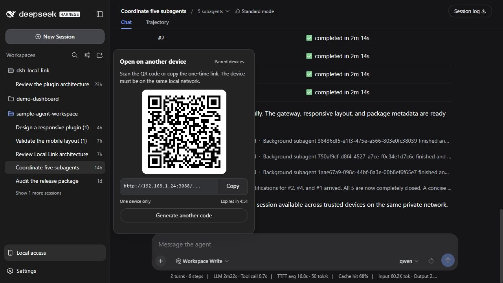
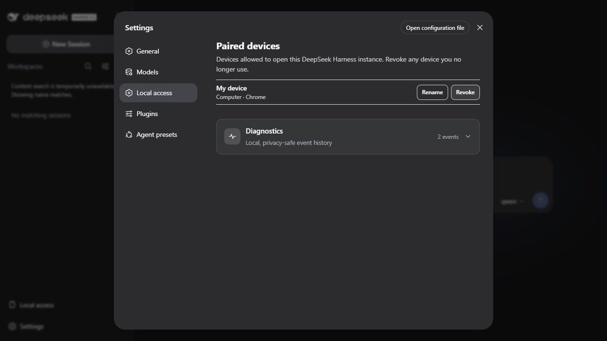
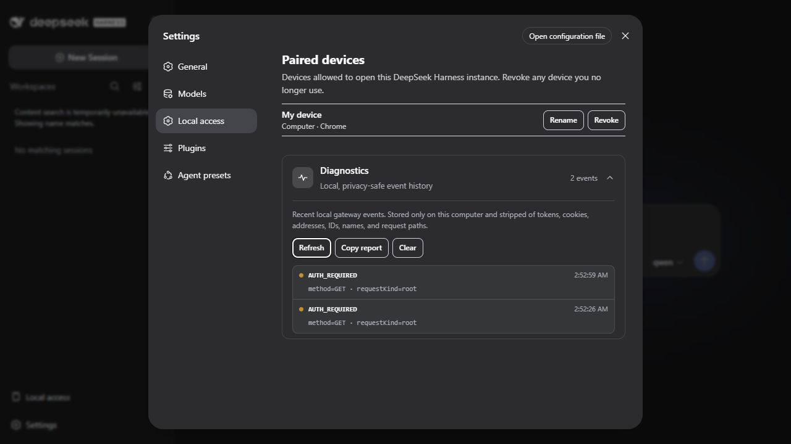

# dsh-local-link

[](https://github.com/DoNotEatMe/dsh-local-link/actions/workflows/ci.yml)
[](https://www.npmjs.com/package/dsh-local-link)
[](LICENSE)

Lightweight, self-hosted [DeepSeek Harness](https://github.com/deepseek-ai/deepseek-harness) plugin for paired LAN access to the complete DSH Web interface.

Open `Local access`, scan one QR code, and continue the desktop's currently selected Harness session from a phone, tablet, or another computer on the same private network. There is no hosted relay, tunnel provider, native application, account, replacement chat UI, or second workspace picker.

> **Preview security boundary:** the `0.1.x` gateway uses plain HTTP and is intended only for a trusted private network. Do not expose its port to the internet or use it on public Wi-Fi.

## Install

### npm — recommended

Stop a running `dsh web` process, install the plugin into the Web profile, then start Harness again:

```shell
dsh plugin --profile web add dsh-local-link
dsh web
```

This command becomes installable with the first public npm release. Until then, use the source checkout below.

### Git clone — development checkout

Requirements: Git, Node.js 22.19+ or 24+, Corepack, and a global `dsh` installation running DeepSeek Harness `0.1.1-rc.2`.

```shell
git clone https://github.com/DoNotEatMe/dsh-local-link.git
cd dsh-local-link
corepack pnpm install --frozen-lockfile
npm run verify
dsh plugin --profile web add .
dsh web
```

The profile points at the checkout, so rebuild after changing client code and restart `dsh web` after Host-side changes.

## Use

### Open Harness on another device

1. Open the session you want on the computer.
2. Click `Local access` at the bottom of the Harness sidebar.
3. Scan the QR code or copy the one-time link to another device on the same network.
4. The first browser to use the invitation opens the full Harness UI at the selected session.

The invitation is one-use, expires after five minutes by default, and is replaced immediately when `Generate another code` is selected.

<p align="center">
  
</p>

### Manage trusted browsers

Use `Paired devices` in the QR panel or open `Settings → Local access`. Each new browser starts as `My device`; its subtitle is detected automatically, for example `Phone · Chrome`, `Tablet · Safari`, or `Computer · Edge`.

- `Rename` changes display metadata only.
- `Revoke` invalidates the browser credential for subsequent HTTP requests and reconnects.
- A cleared cookie, private window, new browser profile, or revoked device needs a new invitation.

Browsers do not reliably distinguish laptops from desktop computers, so both are shown as `Computer`.

<p align="center">
  
</p>

Expand `Diagnostics` on the same Settings page to inspect the most recent local gateway events. `Copy report` produces issue-ready JSON and `Clear` removes the local history. The report contains event codes, timestamps, severity, and a small allowlisted context only; it never includes pairing tokens, cookies, IP addresses, device or session IDs, device names, request paths, prompts, conversations, or project files.

<p align="center">
  
</p>

## Why it stays small

- **Stock Harness UI:** the plugin opens the existing Web client and live agent stream.
- **Local only:** one private-network gateway forwards to the loopback Harness Host.
- **Two runtime dependencies:** configuration schema support and QR generation.
- **No fingerprinting:** access is a random per-browser credential, not a device identity guess.
- **Native extension points:** sidebar and Settings content use Harness slots and locale services.
- **JSON localization:** all visible plugin copy lives in matching locale dictionaries.
- **Local diagnostics:** a bounded, redacted event history helps debug installs without analytics or an external collector.

## How it works

```text
Desktop browser on 127.0.0.1:3080
  └─ Local access → one-use invitation
                         │
Phone / tablet / computer on the private LAN
  └─ 192.168.x.x:3088 → network + Host validation
                       → pairing or device-cookie validation
                       → HTTP / WebSocket proxy
                       → 127.0.0.1:3080 (the same Harness Host)
```

The gateway does not create a second Harness session. During first connection it transfers the desktop browser's current session selection to the new browser origin; session data and ongoing conversation events still come from the same Host.

Authorization uses a 256-bit random cookie credential. Only its SHA-256 hash is stored. The editable name and detected device/browser text never grant access.

## Configuration

The bundled profile patch installs conservative defaults:

| Option | Default | Purpose |
| --- | --- | --- |
| `listenHost` | `0.0.0.0` | Listen on local interfaces; request validation still accepts only private/loopback sources. |
| `listenPort` | `3088` | LAN gateway port. |
| `upstreamOrigin` | `http://127.0.0.1:3080` | Existing loopback Harness Web server. |
| `accessMode` | `pairing` | Require a one-use invitation and device cookie. |
| `pairingTtlSeconds` | `300` | Invitation lifetime. |
| `deviceTtlDays` | `90` | Remembered-browser lifetime. |
| `diagnosticsEnabled` | `true` | Keep the bounded local diagnostic history. |
| `diagnosticsMaxEntries` | `15` | Maximum retained events (`5`–`200`). |
| `diagnosticsFile` | next to `stateFile` | Local JSON event store; the bundled profile uses `~/.dsh/local-link/diagnostics.json`. |

`trusted-lan` disables per-device authorization and should be reserved for isolated development networks. `pairing` is the supported default because a connected Harness browser can read files, submit prompts, approve actions, and trigger commands.

The plugin never creates firewall rules. If Windows prompts for network access, allow only the **Private** network profile and never forward port `3088` on the router.

## Troubleshooting and diagnostics

Diagnostics are a local, event-driven history of failures—not a request log. The plugin retains 15 events by default, shows the newest 12, coalesces identical five-second bursts, and records nothing for successful starts, requests, pairing, copies, renames, or revocations.

For support:

1. Reproduce the failed action once.
2. Open `Settings → Local access → Diagnostics`.
3. Click `Refresh` if the panel was already open.
4. Use the newest stable event code to identify the failed boundary.
5. Click `Copy report`, review the JSON, and attach it to an issue if needed.

The report never includes secrets, addresses, IDs, names, URLs, paths, prompts, conversations, or project data and is never uploaded automatically. See the [event reference and first checks](docs/DIAGNOSTICS.md) for every tracked failure.

## Localization

Harness's active language selects the plugin dictionary; the plugin has no separate language switch.

| Language | Dictionary | Status |
| --- | --- | --- |
| English | `src/locales/en.json` | Included |
| Chinese | `src/locales/zh.json` | Included |

Dictionary keys are checked for parity in tests. To add a locale, copy `en.json`, translate values without changing keys, register the locale ID in `src/client.tsx`, and run `npm test`.

## Development

```shell
corepack pnpm install --frozen-lockfile
npm run typecheck
npm test
npm run build
npm run verify
```

Project documentation:

- [Architecture and compatibility boundaries](docs/ARCHITECTURE.md)
- [Local diagnostics and event codes](docs/DIAGNOSTICS.md)
- [Security model](docs/SECURITY.md)
- [Contributing](CONTRIBUTING.md)
- [Security reporting](SECURITY.md)

## Known limitations

- LAN traffic is not encrypted in `0.1.x`.
- Revocation blocks new requests and reconnects but does not yet terminate an already-open WebSocket.
- The shortcut that opens a specific Settings section uses a small semantic compatibility bridge because Harness `0.1.1-rc.2` exposes `openSection` only to onboarding.
- Harness's footer-action container needs a compatibility layout rule when the full-width Cordis action is present.
- Compatibility is currently pinned to DeepSeek Harness `0.1.1-rc.2` and must be retested for each supported Harness release.

## Development disclosure

The initial implementation and documentation were developed collaboratively with OpenAI Codex. Changes remain subject to maintainer review, automated tests, security review, and the same contribution requirements as human-authored changes. No runtime AI service, telemetry, or generated-code dependency is included in the package.

## License

[MIT](LICENSE) © 2026 dsh-local-link contributors.
