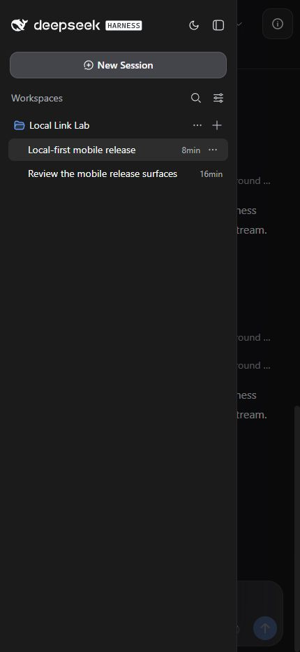
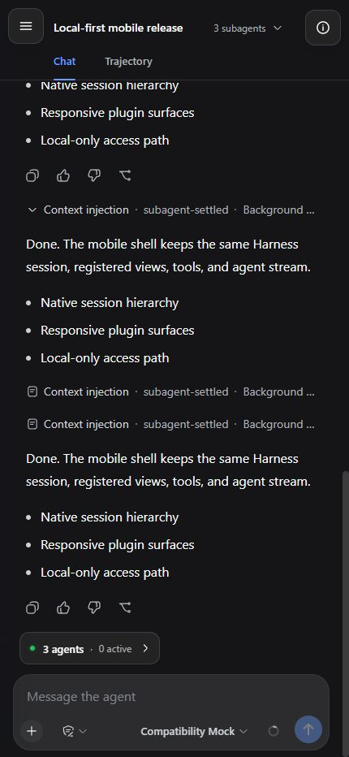
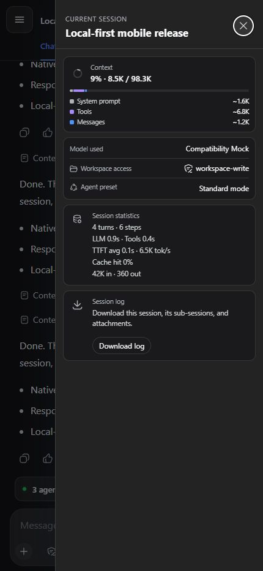
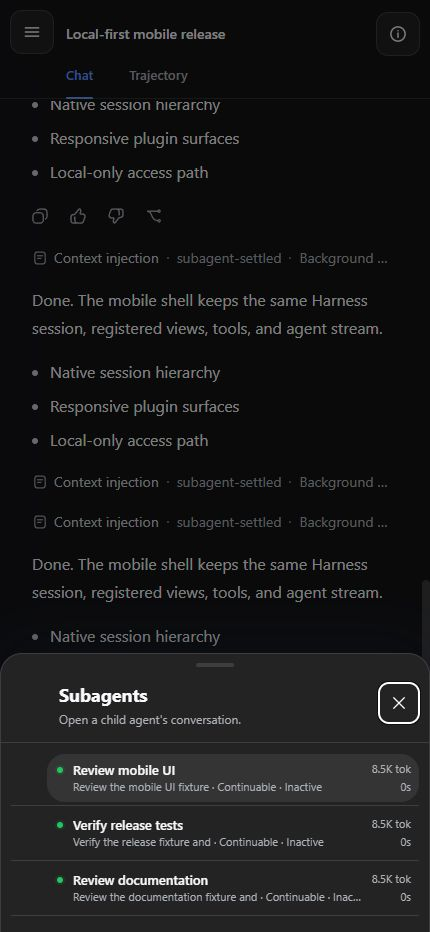
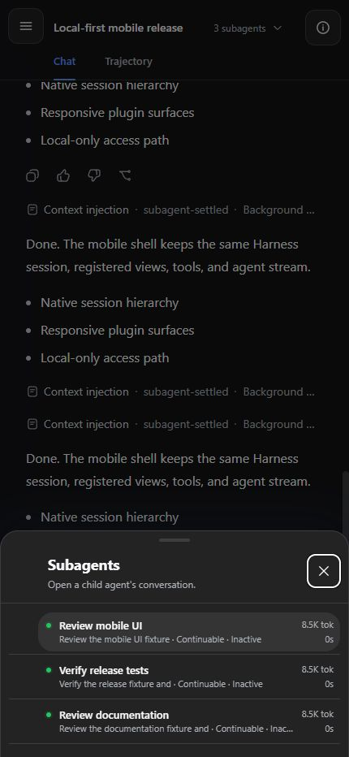
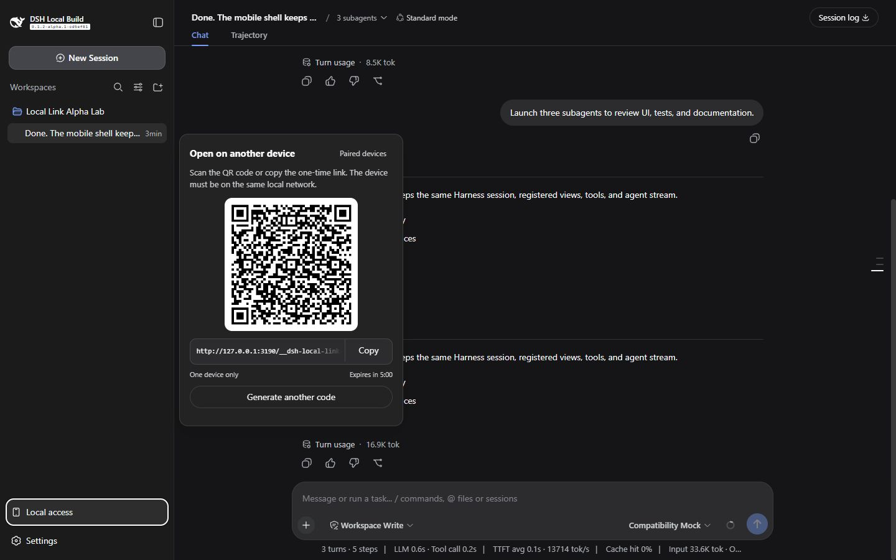
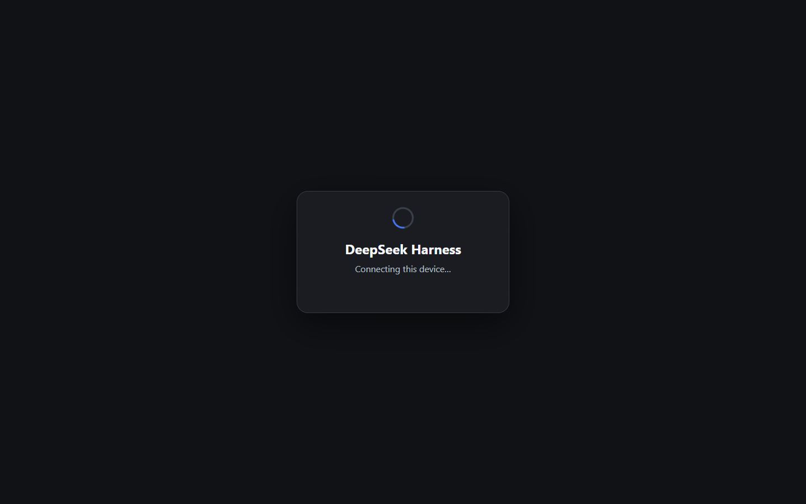
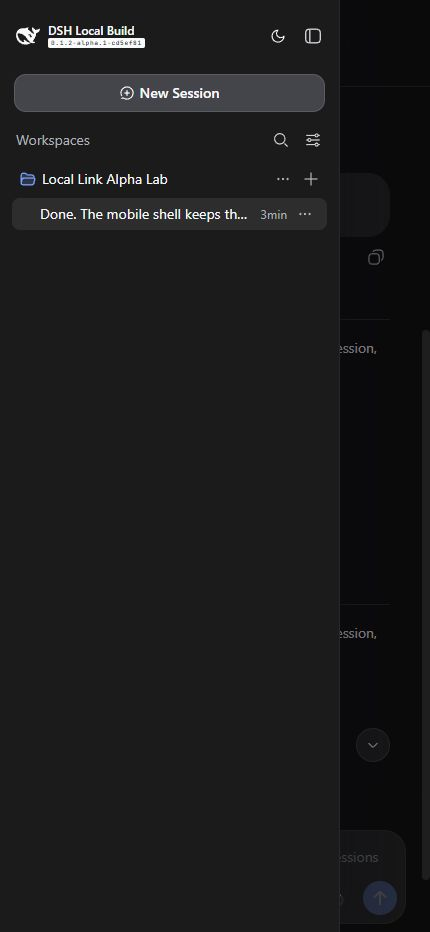
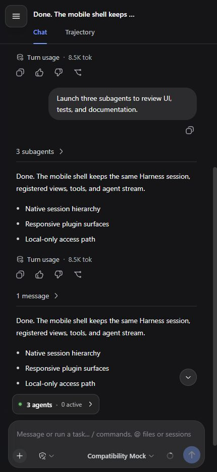
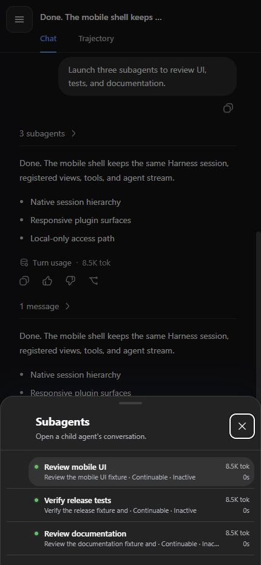

# DeepSeek Harness compatibility

Local Link extends version-sensitive Harness Host, client-slot, theme, layout,
session, and Settings contracts. Compatibility is recorded from isolated
installations and live browser checks, not inferred from package versions.

The format follows the DSH community convention: name the exact Harness
version, the last verification date, a status, and inspectable evidence.

## Compatibility matrix

Verified on 2026-08-29 with the published `dsh-local-link@0.2.1` package,
Node.js 22, and Windows:

| DeepSeek Harness | Status | Evidence |
| --- | --- | --- |
| `0.1.1-rc.2` | **Supported baseline** | Complete Local Link typecheck and 92-test suite; clean package/profile install; Host `200`; unauthenticated gateway `401`; client boot entry; populated Mobile View fixture across navigation, chat, Current session, and subagents |
| `0.1.1-rc.1` | **Verified previous release** | Clean package/profile install; Host and gateway boundary checks; client boot entry; the same populated four-surface Mobile View fixture |
| `0.1.0-rc.8` | **Verified previous release** | Clean package/profile install; Host and gateway boundary checks; client boot entry; the same populated four-surface Mobile View fixture |
| `0.1.2-alpha.1` | **Known incompatible** | Official tag `dsh-v0.1.2-alpha.1` (`cd5ef814…`) builds and accepts the plugin, but Local Link pairing cannot establish the new authority-bound Harness browser session; the alpha header also prevents the Current session action from mounting |

Versions older than `0.1.0-rc.8` are untested and unsupported.

### Status meanings

- **Supported baseline** receives the complete repository verification gate and
  the populated browser compatibility fixture.
- **Verified previous release** proves published-package installation, boot and
  the same populated browser fixture. It remains a compatibility target, but
  new development is based on the supported baseline.
- **Known incompatible** means the published plugin was installed and exercised,
  and at least one required end-to-end behavior failed.

## Browser evidence

Every capture below comes from the same real Harness session and the same safe
English fixture at `430 × 932`. Each version was opened at its plain root URL.
There is no Mobile View URL flag, alternate bundle, user-agent branch, or URL
rewrite: `matchMedia('(max-width: 834px)')` selects the responsive presentation.

| Harness | Left navigation | Chat |
| --- | --- | --- |
| `0.1.1-rc.2` |  |  |
| `0.1.1-rc.1` |  |  |
| `0.1.0-rc.8` |  |  |

| Harness | Current session | Subagents |
| --- | --- | --- |
| `0.1.1-rc.2` |  |  |
| `0.1.1-rc.1` |  |  |
| `0.1.0-rc.8` |  |  |

The screenshots prove the four named responsive surfaces with a populated
session. They do not replace the real-phone portrait/landscape checklist or
prove arbitrary third-party fixed-width views.

### `0.1.2-alpha.1` incompatibility evidence

The alpha was checked from the official Git tag because it was not available
through the npm release channel. The checkout built successfully, and the
published `dsh-local-link@0.2.1` package installed into an isolated alpha Web
profile. Desktop Local access, QR generation, responsive chat, navigation, and
the subagent sheet mounted. That partial rendering is not enough to call the
release compatible.

| Alpha desktop integration | Required pairing path |
| --- | --- |
|  |  |

| Alpha navigation | Alpha chat | Alpha subagents |
| --- | --- | --- |
|  |  |  |

The pairing POST consumes the invitation and records the browser, but the next
gateway root request cannot establish Harness's new browser authentication and
remains on `Connecting this device…`. Alpha requires an authority-bound signed
cookie for every Host RPC and WebSocket. Local Link's gateway credential is a
different cookie and is deliberately removed before upstream proxying, so the
alpha Host returns `401`. The printed alpha `?token=…` is Harness authentication,
not a Mobile View flag; successful local exchange still redirects to a clean
root URL.

The alpha conversation header also changed enough that the plugin's Current
session action is absent, although the width-driven shell and subagent sheet
still activate. Supporting this release therefore requires an explicit alpha
authentication handoff and a header integration update.

## What was exercised

For each verified Harness version:

1. Install the published plugin into an isolated profile and `DSH_HOME`.
2. Compose the Local Link patch and confirm its client entry in the boot
   manifest.
3. Verify the Host responds, the unauthenticated gateway rejects access, and
   both processes stop after the test.
4. Open the ordinary root URL at `430 × 932` with no query parameter or special
   user agent.
5. Load the same workspace, populated conversation, permissions, model,
   context breakdown, and three settled subagents.
6. Exercise the left navigation, chat, Current session drawer, and subagent
   bottom sheet and capture each surface.

The primary baseline additionally runs type checking, all automated tests, and
the package dry-run.

## Upgrade procedure

For every new Harness prerelease or release:

1. Record the exact version and verification date; never infer compatibility
   from an npm dist-tag.
2. Use a fresh package installation and separate `DSH_HOME`.
3. Inspect upstream Host, client-slot, connection, authentication, theme,
   layout, session, and Settings contract changes before booting the plugin.
4. Repeat the HTTP boundary checks and the populated four-surface browser
   fixture on a plain root URL.
5. Run repository verification against the new dependency baseline.
6. Complete the real-phone portrait and landscape checklist before promoting
   the version to the supported baseline.

A successful install or a single empty-shell screenshot is insufficient.
Harness releases can alter DOM semantics, slot payloads, exported primitives,
theme storage, or responsive geometry while the package still boots.
